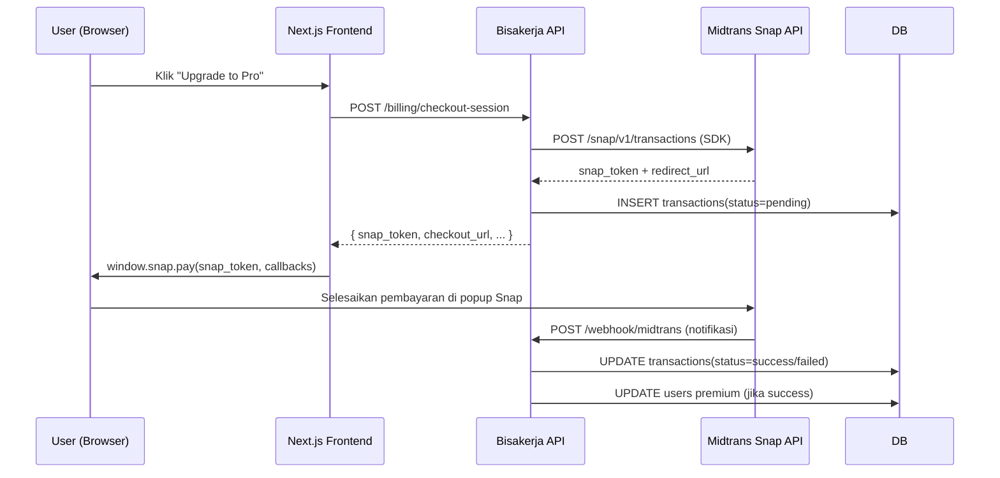

# Midtrans Snap Integration

Dokumen ini menyelaraskan kebutuhan Bisakerja dengan dokumentasi resmi Midtrans Snap (`https://docs.midtrans.com/docs/snap-overview`).

## 1) Dasar Integrasi

### Client Library

- SDK Go: [`github.com/midtrans/midtrans-go`](https://github.com/Midtrans/midtrans-go)
- Snap.js CDN (frontend): lihat bagian 3.

### Environment

| Env | Snap.js URL | API Base |
|---|---|---|
| Sandbox | `https://app.sandbox.midtrans.com/snap/snap.js` | `https://app.sandbox.midtrans.com` |
| Production | `https://app.midtrans.com/snap/snap.js` | `https://app.midtrans.com` |

### Authentication (Backend)

- Header: `Authorization: Basic <base64(ServerKey:)>` (dikelola otomatis oleh SDK).
- Env var backend: `MIDTRANS_SERVER_KEY`, `MIDTRANS_CLIENT_KEY`, `MIDTRANS_ENV`.

### Rate Limit

- Midtrans memberlakukan rate limit per API key. Retry policy untuk `429/5xx`:
  - max 3 kali, exponential backoff + jitter (`200ms`, `400ms`, `800ms`).

## 2) Alur Snap Checkout



## 3) Snap.js (Frontend)

Tambahkan script berikut di halaman checkout (Next.js pricing page):

```tsx
import Script from "next/script";

<Script
  src={
    process.env.NEXT_PUBLIC_MIDTRANS_ENV === "production"
      ? "https://app.midtrans.com/snap/snap.js"
      : "https://app.sandbox.midtrans.com/snap/snap.js"
  }
  data-client-key={process.env.NEXT_PUBLIC_MIDTRANS_CLIENT_KEY}
  strategy="beforeInteractive"
/>
```

Env var frontend: `NEXT_PUBLIC_MIDTRANS_CLIENT_KEY`, `NEXT_PUBLIC_MIDTRANS_ENV`.

Buka popup pembayaran dengan:

```typescript
window.snap.pay(snapToken, {
  onSuccess: () => { /* navigasi ke success page */ },
  onPending: () => { /* simpan state, tampilkan pesan */ },
  onError: () => { /* tampilkan pesan error */ },
  onClose: () => { /* tampilkan pesan tutup popup */ },
});
```

## 4) Webhook Midtrans

- Path: `POST /webhook/midtrans`
- Auth: validasi signature SHA512 (lihat [`webhooks.md`](./webhooks.md)).
- Format payload: flat JSON (bukan nested seperti Mayar).

Contoh payload Midtrans:

```json
{
  "order_id": "pay-a1b2c3d4e5f6a7b8-c9d0e1f2",
  "transaction_status": "settlement",
  "fraud_status": "accept",
  "gross_amount": "49000.00",
  "status_code": "200",
  "signature_key": "<sha512hash>"
}
```

### Normalisasi Status

| `transaction_status` + `fraud_status` | `transactions.status` internal |
|---|---|
| `capture` + `accept` / `settlement` | `success` |
| `pending` | `pending` |
| `cancel` / `expire` / `deny` | `failed` |

## 5) Kontrak Data

### 5.1 Transaction Audit

- `transactions.provider = 'midtrans'`
- `transactions.provider_transaction_id` = `order_id` Midtrans (format `pay-{16hex}-{8hex}`, kolom DB: `mayar_transaction_id`).
- `transactions.status` canonical: `pending`, `reminder`, `success`, `failed`.
- `snap_token` disimpan di `transactions.metadata` untuk keperluan "Continue payment".
### 5.2 Webhook Delivery Audit

- Kunci idempotency: `midtrans:{order_id}:{transaction_status}`.
- `processing_status`: `processed`, `ignored_duplicate`, `rejected`.

## 6) Reliability Contract

- Outbound SDK call ke Midtrans:
  - timeout default SDK (dikelola oleh `midtrans-go`),
  - retry `429/5xx` max 3x (`200ms`, `400ms`, `800ms` + jitter).
- Webhook processing wajib transaksi DB atomik.
- Rekonsiliasi periodik via `billing-worker` (menggunakan `coreapi.CheckTransaction(orderID)`).

## 7) Troubleshooting `MIDTRANS_UPSTREAM_ERROR` (502)

Jika API internal mengembalikan:

- `code`: `MIDTRANS_UPSTREAM_ERROR`
- `message`: `midtrans upstream error ...`

Lakukan checklist:

1. Verifikasi env backend: `MIDTRANS_SERVER_KEY`, `MIDTRANS_CLIENT_KEY`, `MIDTRANS_ENV`.
2. Pastikan `MIDTRANS_ENV=sandbox` untuk development, `production` untuk production.
3. Cek log backend untuk status code dan pesan error dari Midtrans SDK.
4. Verifikasi `NEXT_PUBLIC_MIDTRANS_CLIENT_KEY` sesuai dengan environment frontend.
5. Gunakan `request_id` response Bisakerja untuk korelasi log saat investigasi.
