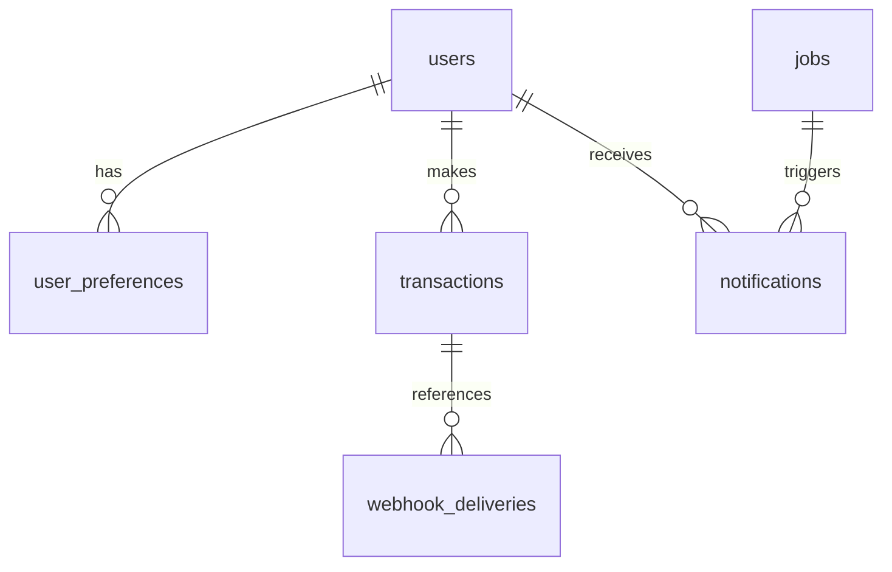

# Database Schema Architecture

Database utama menggunakan **PostgreSQL 16+**.

## 1. Prinsip Desain

- **Normalized core data** untuk user, jobs, transaksi, dan notifikasi.
- **Idempotent ingestion** untuk mencegah duplikasi data scraping.
- **Auditability** untuk billing dan webhook Mayar.
- **Read-optimized indexing** untuk search, listing, dan query operasional.

## 2. Entity Relationship



## 3. Tabel Inti

### 3.1 `users`

Menyimpan identitas user + status subscription + referensi customer di Mayar.

| Column | Type | Notes |
|---|---|---|
| id | uuid | PK |
| email | text | Unique |
| password_hash | text | Bcrypt/Argon2 hash |
| name | text | Display name |
| role | text | `user` / `admin` |
| is_premium | boolean | default false |
| premium_expired_at | timestamp | null untuk free user |
| mayar_customer_id | text | nullable, unique jika sudah sinkron |
| created_at | timestamp | default now |
| updated_at | timestamp | default now |

### 3.2 `user_preferences`

Menyimpan preferensi job untuk matching.

| Column | Type | Notes |
|---|---|---|
| id | uuid | PK |
| user_id | uuid | FK -> users.id |
| keywords | text[] | daftar keyword |
| locations | text[] | daftar lokasi |
| job_types | text[] | daftar tipe pekerjaan |
| salary_min | integer | minimum salary |
| updated_at | timestamp | default now |

### 3.3 `jobs`

Menyimpan hasil agregasi lowongan.

| Column | Type | Notes |
|---|---|---|
| id | uuid | PK |
| original_job_id | text | id dari source |
| source | text | glints/jobstreet/linkedin/etc |
| title | text | judul lowongan |
| company | text | nama perusahaan |
| location | text | lokasi lowongan |
| description | text | deskripsi lowongan |
| salary_range | text | salary raw/normalized |
| url | text | URL asli lowongan |
| raw_data | jsonb | payload source mentah |
| posted_at | timestamp | tanggal posting dari source |
| created_at | timestamp | waktu insert sistem |

Constraint wajib:

```sql
UNIQUE (source, original_job_id)
```

### 3.4 `transactions`

Menyimpan jejak status pembayaran dari provider (MVP: Mayar).

| Column | Type | Notes |
|---|---|---|
| id | uuid | PK |
| user_id | uuid | FK -> users.id |
| provider | text | default `mayar` |
| mayar_transaction_id | text | id transaksi gateway |
| mayar_payment_link_id | text | id invoice/payment link Mayar |
| mayar_event_type | text | contoh: `payment.received` |
| status | text | `pending/reminder/success/failed` |
| amount | integer | nominal pembayaran |
| raw_payload | jsonb | payload event terakhir |
| processed_at | timestamp | waktu terakhir diproses |
| created_at | timestamp | default now |

Constraint wajib:

```sql
UNIQUE (provider, mayar_transaction_id)
```

Status mapping canonical:

- `pending`: checkout dibuat, pembayaran belum terkonfirmasi.
- `reminder`: event `payment.reminder` diterima, belum ada pembayaran sukses.
- `success`: event `payment.received` dengan status paid/success; premium boleh diaktifkan.
- `failed`: transaksi berakhir gagal/expired/canceled.

Aturan penting: **hanya `success` yang boleh mengubah entitlement premium menjadi aktif**.

### 3.5 `webhook_deliveries`

Menyimpan jejak webhook inbound untuk audit dan idempotensi.

| Column | Type | Notes |
|---|---|---|
| id | uuid | PK |
| provider | text | default `mayar` |
| idempotency_key | text | unique, format `mayar:{event}:{transactionId}` |
| event_type | text | nama event |
| mayar_transaction_id | text | referensi transaksi jika ada |
| payload_raw | jsonb | payload mentah |
| processing_status | text | `processed/ignored_duplicate/rejected` |
| http_status | integer | status response saat diproses |
| error_message | text | nullable |
| received_at | timestamp | default now |
| processed_at | timestamp | nullable |

### 3.6 `notifications`

Menyimpan riwayat notifikasi user.

| Column | Type | Notes |
|---|---|---|
| id | uuid | PK |
| user_id | uuid | FK -> users.id |
| job_id | uuid | FK -> jobs.id |
| channel | text | email/whatsapp |
| status | text | pending/sent/failed |
| sent_at | timestamp | nullable |
| created_at | timestamp | default now |

Constraint rekomendasi:

```sql
UNIQUE (user_id, job_id, channel)
```

## 4. SQL DDL Contoh

```sql
CREATE EXTENSION IF NOT EXISTS pg_trgm;

CREATE TABLE users (
  id uuid PRIMARY KEY,
  email text NOT NULL UNIQUE,
  password_hash text NOT NULL,
  name text NOT NULL,
  role text NOT NULL DEFAULT 'user',
  is_premium boolean NOT NULL DEFAULT false,
  premium_expired_at timestamp NULL,
  mayar_customer_id text NULL UNIQUE,
  created_at timestamp NOT NULL DEFAULT now(),
  updated_at timestamp NOT NULL DEFAULT now()
);

CREATE TABLE user_preferences (
  id uuid PRIMARY KEY,
  user_id uuid NOT NULL REFERENCES users(id) ON DELETE CASCADE,
  keywords text[] NOT NULL DEFAULT '{}',
  locations text[] NOT NULL DEFAULT '{}',
  job_types text[] NOT NULL DEFAULT '{}',
  salary_min integer NOT NULL DEFAULT 0,
  updated_at timestamp NOT NULL DEFAULT now()
);

CREATE TABLE jobs (
  id uuid PRIMARY KEY,
  original_job_id text NOT NULL,
  source text NOT NULL,
  title text NOT NULL,
  company text NOT NULL,
  location text,
  description text,
  salary_range text,
  url text NOT NULL,
  raw_data jsonb NOT NULL DEFAULT '{}'::jsonb,
  posted_at timestamp,
  created_at timestamp NOT NULL DEFAULT now(),
  UNIQUE(source, original_job_id)
);

CREATE TABLE transactions (
  id uuid PRIMARY KEY,
  user_id uuid NOT NULL REFERENCES users(id),
  provider text NOT NULL DEFAULT 'mayar',
  mayar_transaction_id text NOT NULL,
  mayar_payment_link_id text,
  mayar_event_type text,
  status text NOT NULL CHECK (status IN ('pending', 'reminder', 'success', 'failed')),
  amount integer NOT NULL,
  raw_payload jsonb NOT NULL DEFAULT '{}'::jsonb,
  processed_at timestamp NULL,
  created_at timestamp NOT NULL DEFAULT now(),
  UNIQUE (provider, mayar_transaction_id)
);

CREATE TABLE webhook_deliveries (
  id uuid PRIMARY KEY,
  provider text NOT NULL DEFAULT 'mayar',
  idempotency_key text NOT NULL UNIQUE,
  event_type text NOT NULL,
  mayar_transaction_id text,
  payload_raw jsonb NOT NULL,
  processing_status text NOT NULL CHECK (processing_status IN ('processed', 'ignored_duplicate', 'rejected')),
  http_status integer NOT NULL,
  error_message text,
  received_at timestamp NOT NULL DEFAULT now(),
  processed_at timestamp NULL
);

CREATE TABLE notifications (
  id uuid PRIMARY KEY,
  user_id uuid NOT NULL REFERENCES users(id) ON DELETE CASCADE,
  job_id uuid NOT NULL REFERENCES jobs(id) ON DELETE CASCADE,
  channel text NOT NULL,
  status text NOT NULL CHECK (status IN ('pending', 'sent', 'failed')),
  sent_at timestamp NULL,
  created_at timestamp NOT NULL DEFAULT now(),
  UNIQUE (user_id, job_id, channel)
);
```

## 5. Index Strategy

```sql
CREATE INDEX idx_jobs_title_trgm
ON jobs USING gin (title gin_trgm_ops);

CREATE INDEX idx_jobs_company_trgm
ON jobs USING gin (company gin_trgm_ops);

CREATE INDEX idx_jobs_posted_at
ON jobs (posted_at DESC);

CREATE INDEX idx_notifications_user_id
ON notifications (user_id);

CREATE INDEX idx_transactions_user_created
ON transactions (user_id, created_at DESC);

CREATE INDEX idx_transactions_status
ON transactions (status);

CREATE INDEX idx_webhook_deliveries_received
ON webhook_deliveries (received_at DESC);
```

## 6. Akses Pola Query

### Query Paling Sering

- Search jobs by keyword + location.
- List jobs terbaru.
- Fetch user preferences untuk matching.
- Update status notifikasi.
- Update status premium user dari webhook.
- Query histori transaksi user.
- Audit webhook delivery dan retry.

### Optimasi Penting

- Gunakan pagination berbasis `limit` + `offset` untuk MVP.
- Pastikan query search memakai index yang benar (`EXPLAIN ANALYZE`).
- Pisahkan query operasional (dashboard/admin) dari query user-facing jika volume meningkat.

## 7. Integritas Data

- Scraper insert harus idempotent:

```sql
INSERT INTO jobs (...)
VALUES (...)
ON CONFLICT (source, original_job_id) DO NOTHING;
```

- Webhook payment harus idempotent berdasarkan `idempotency_key` dan `mayar_transaction_id`.
- Update premium user harus terjadi dalam transaksi DB atomik bersama update `transactions`.

Contoh pola transaksi webhook (ringkas):

```sql
BEGIN;
-- guard idempotency
INSERT INTO webhook_deliveries (id, provider, idempotency_key, event_type, mayar_transaction_id, payload_raw, processing_status, http_status, received_at)
VALUES ($1, 'mayar', $2, $3, $4, $5, 'processed', 200, now())
ON CONFLICT (idempotency_key) DO NOTHING;

-- jika insert di atas conflict, hentikan side effect dan return 200 idempotent

UPDATE transactions
SET status = $6, raw_payload = $5, processed_at = now()
WHERE provider = 'mayar' AND mayar_transaction_id = $4;

-- hanya untuk status success
UPDATE users
SET is_premium = true, premium_expired_at = $7, updated_at = now()
WHERE id = $8 AND $6 = 'success';
COMMIT;
```
