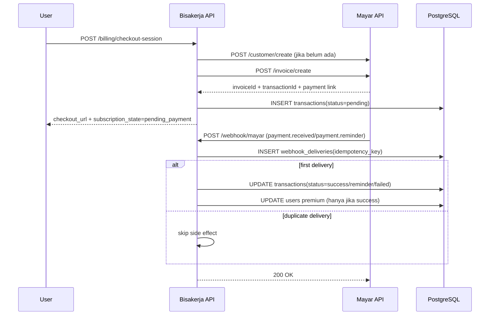

# Mayar Integration Architecture

## 1. Tujuan

Menetapkan desain integrasi payment gateway Mayar yang konsisten antara API, database, dan alur operasional Bisakerja.

## 2. Komponen Terkait

- `API Service`:
  - create checkout session,
  - menerima webhook,
  - update status premium.
- `PostgreSQL`:
  - sumber data transaksi dan audit webhook.
- `Redis`:
  - rate limit outbound request ke Mayar,
  - queue rekonsiliasi jika perlu retry async.
- `Mayar`:
  - customer + invoice APIs,
  - webhook delivery.

## 3. Alur Integrasi Inti

## 4. Kontrak Data

### 4.1 User to Mayar

- `users.mayar_customer_id` menyimpan customer ID dari Mayar agar tidak create berulang.

### 4.2 Transaction Audit

- `transactions.provider = 'mayar'`
- `transactions.mayar_transaction_id` menjadi key referensi utama.
- `transactions.status` canonical: `pending`, `reminder`, `success`, `failed`.
- `transactions.raw_payload` menyimpan payload event terakhir yang mempengaruhi status.

### 4.3 Webhook Delivery Audit

- `webhook_deliveries` menyimpan raw payload tiap event unik.
- Idempotency key: `mayar:{event}:{transactionId}`.
- `processing_status`: `processed`, `ignored_duplicate`, `rejected`.

## 5. Reliability & Recovery

- Outbound call Mayar:
  - throttle aman <= 18 req/min/IP,
  - timeout 5 detik per request,
  - retry `429/5xx` max 3x (`200ms`, `400ms`, `800ms` + jitter).
- Webhook processing wajib transaksi DB atomik (`webhook_deliveries`, `transactions`, `users`).
- Jika status mismatch ditemukan:
  - rekonsiliasi via `/transactions` atau `/invoice/{id}`.
- Jika endpoint webhook sempat down:
  - gunakan `POST /webhook/retry` dari Mayar dashboard/API.

## 6. Security

Dokumentasi webhook Mayar tidak secara eksplisit mewajibkan signature header. Maka strategi minimum Bisakerja:

1. URL webhook menggunakan secret token acak (path/header/query).
2. Validasi payload dan skema field wajib.
3. Idempotency strict pada event transaksi.
4. Logging lengkap untuk investigasi.

## 7. Observability & SLO Minimum

| Metric | Target |
|---|---|
| `mayar_api_rate_limited_total / mayar_api_request_total` | < 1% per 1 jam |
| `mayar_webhook_processing_duration_ms` p95 | < 500 ms |
| `mayar_webhook_failed_total / mayar_webhook_received_total` | < 1% per 15 menit |
| Checkout API (`POST /billing/checkout-session`) p95 | < 2 detik |

## 8. Operational Alerts

- Alert warning: rasio `MAYAR_RATE_LIMITED` > 1% selama 1 jam.
- Alert critical: webhook failure ratio > 5% selama 5 menit.
- Alert warning: ada transaksi `pending/reminder` > 24 jam tanpa update.
