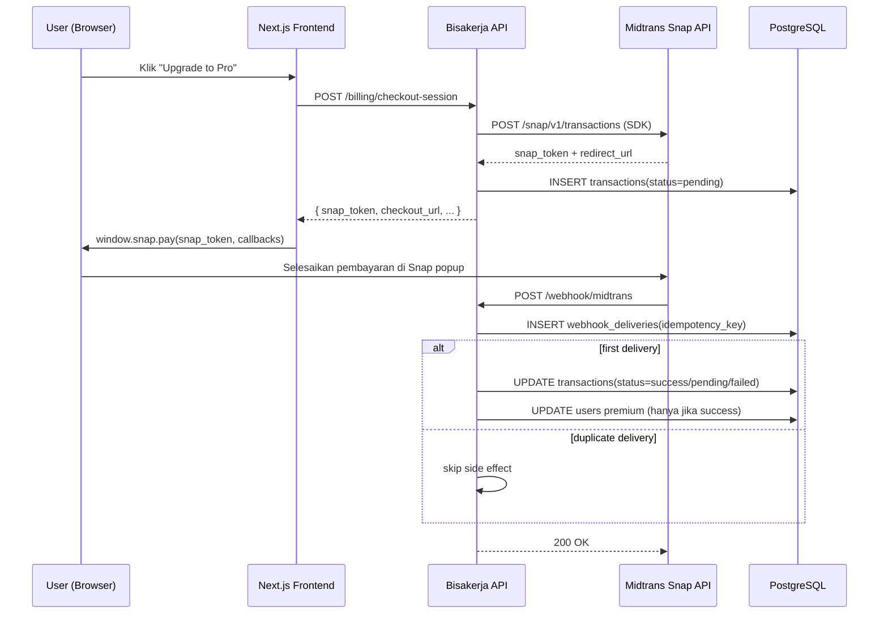

# Midtrans Integration Architecture

## 1. Tujuan

Menetapkan desain integrasi payment gateway Midtrans yang konsisten antara API, database, dan alur operasional Bisakerja.

## 2. Komponen Terkait

- `API Service`:
  - create checkout session (Snap),
  - menerima webhook,
  - update status premium.
- `Billing Worker`:
  - rekonsiliasi periodik status transaksi via Midtrans Core API.
- `PostgreSQL`:
  - sumber data transaksi dan audit webhook.
- `Midtrans`:
  - Snap API (create transaction, popup payment),
  - Core API (check transaction status),
  - webhook delivery.

## 3. Alur Integrasi Inti

## 4. Kontrak Data

### 4.1 Transaction Audit

- `transactions.provider = 'midtrans'`
- `transactions.provider_transaction_id` (kolom DB: `mayar_transaction_id`) menjadi kunci referensi utama.
- Format nilai: `order_id` Midtrans, yaitu `checkout:{userID}:{idempotencyKey}`.
- `transactions.status` canonical: `pending`, `reminder`, `success`, `failed`.
- `snap_token` disimpan di `transactions.metadata` (field `snap_token`) untuk "Continue payment".

### 4.2 Webhook Delivery Audit

- `webhook_deliveries` menyimpan raw payload tiap event unik.
- Idempotency key: `midtrans:{order_id}`.
- `processing_status`: `processed`, `ignored_duplicate`, `rejected`.

## 5. Reliability & Recovery

- Outbound SDK call ke Midtrans:
  - timeout dikelola oleh `midtrans-go` SDK,
  - retry `429/5xx` max 3x (`200ms`, `400ms`, `800ms` + jitter).
- Webhook processing wajib transaksi DB atomik (`webhook_deliveries`, `transactions`, `users`).
- Jika status mismatch ditemukan:
  - billing worker melakukan rekonsiliasi periodik via `coreapi.CheckTransaction(orderID)`.
  - hanya transaksi `pending/reminder` yang discan pada tiap tick worker.
- Jika endpoint webhook sempat down:
  - Midtrans akan retry otomatis pada response non-2xx.
  - Untuk replay manual, gunakan Midtrans dashboard → Notification → Resend.

## 6. Security

Midtrans menggunakan signature validation:

1. Signature: `SHA512(order_id + status_code + gross_amount + server_key)`.
2. Validasi signature wajib dilakukan sebelum memproses webhook.
3. Payload tanpa signature atau signature tidak cocok ditolak (`400 BAD_REQUEST`).
4. Idempotency strict pada setiap `order_id`.
5. Logging lengkap untuk investigasi.

## 7. Observability & SLO Minimum

| Metric | Target |
|---|---|
| `midtrans_api_rate_limited_total / midtrans_api_request_total` | < 1% per 1 jam |
| `midtrans_webhook_processing_duration_ms` p95 | < 500 ms |
| `midtrans_webhook_failed_total / midtrans_webhook_received_total` | < 1% per 15 menit |
| Checkout API (`POST /billing/checkout-session`) p95 | < 2 detik |

## 8. Operational Alerts

- Alert warning: rasio `MIDTRANS_RATE_LIMITED` > 1% selama 1 jam.
- Alert critical: webhook failure ratio > 5% selama 5 menit.
- Alert warning: ada transaksi `pending/reminder` > 24 jam tanpa update.
