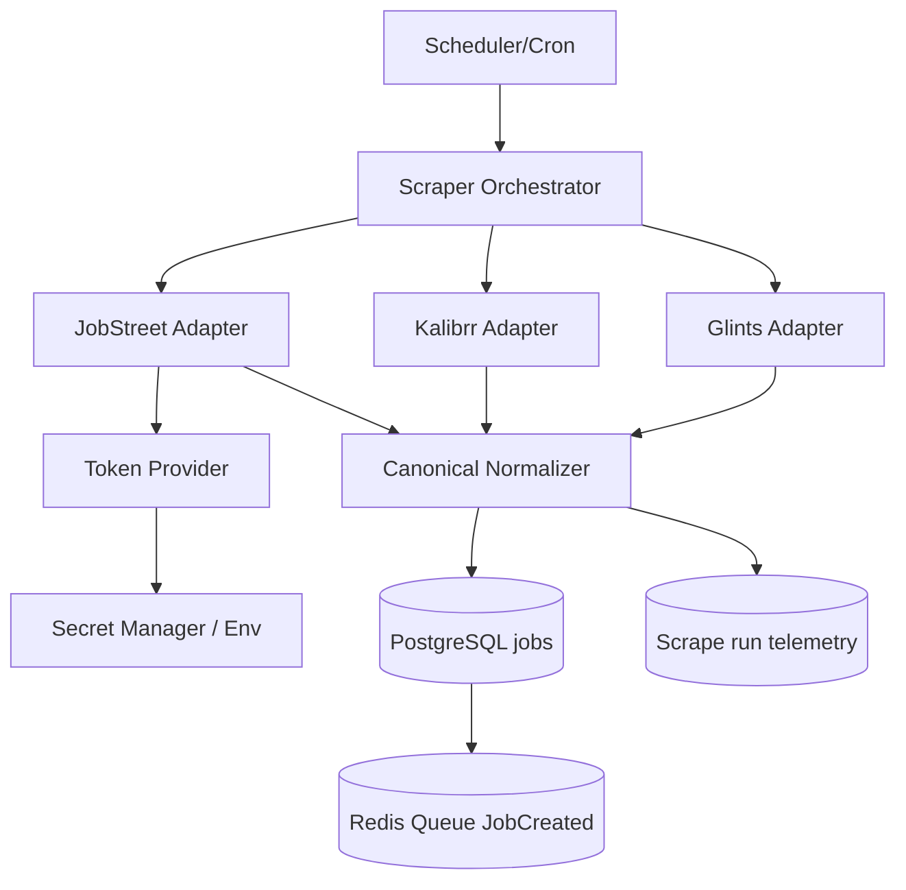

# Scraper Source Adapters Architecture

Dokumen ini mendefinisikan arsitektur adapter untuk scraping source yang heterogen (Glints, Kalibrr, JobStreet) agar implementasi Iteration 1.1 tetap modular, aman, dan mudah diobservasi.

## 1) Prinsip Desain

1. **Isolasi per source**: parser/request builder tidak saling bergantung.
2. **Contract-first normalizer**: semua output source harus dinormalisasi ke model canonical sebelum insert DB.
3. **Auth-aware orchestration**: source tanpa auth dan source dengan bearer token ditangani lewat alur yang sama.
4. **Failure isolation**: satu source gagal tidak menggagalkan batch source lain.

## 2) Komponen Utama



## 3) Adapter Contract (Go)

```go
type SourceAdapter interface {
    SourceName() string
    RequiresAuth() bool
    FetchPage(ctx context.Context, req FetchRequest) (FetchResult, error)
}

type TokenProvider interface {
    Resolve(ctx context.Context, source string) (TokenResult, error)
}

type TokenResult struct {
    Token     string
    Source    string // env, secret-manager, manual
    ExpiresAt time.Time
}
```

Catatan:

- `JobStreetAdapter.RequiresAuth() == true`.
- `GlintsAdapter` dan `KalibrrAdapter` tidak membutuhkan token pada baseline saat ini.

## 4) Orchestrator State Machine

1. `scheduled` -> scheduler memulai batch run.
2. `preflight` -> cek capability source + token readiness.
3. `fetching` -> request ke source endpoint per keyword/page.
4. `normalizing` -> mapping payload source ke schema canonical.
5. `persisting` -> insert idempotent ke tabel `jobs`.
6. `publishing` -> event `JobCreated` hanya untuk row baru.
7. `completed_partial/completed_success/failed` -> hasil akhir batch.

## 5) Error Classification

| Class | Contoh | Dampak | Aksi |
|---|---|---|---|
| `auth_missing` | token JobStreet tidak tersedia | source tertentu gagal | lanjut source lain + trigger runbook token |
| `auth_failed` | `401/403` dari source auth-required | source tertentu gagal | invalidasi token + retry terbatas |
| `rate_limited` | `429` | source melambat | exponential backoff + jitter |
| `source_unavailable` | `5xx`/timeout source | source tertentu gagal | retry bounded + catat telemetry |
| `parse_error` | schema source berubah | partial ingest | simpan sample payload + alert parser drift |

## 6) Observability & Audit

Minimum field telemetry per source run:

- `run_id`
- `source`
- `keyword`
- `page`
- `status` (`success`, `partial`, `failed`, `failed_auth`)
- `fetched_count`
- `inserted_count`
- `duplicate_count`
- `error_message`
- `source_operation`
- `http_status_last`
- `error_class`
- `duration_ms`
- `request_id`

Rekomendasi implementasi Iteration 1.1:

- Tambahkan tabel operasional terpisah (misalnya `scrape_runs` dan `scrape_run_sources`) atau simpan event structured log yang setara.
- Structured log worker sebaiknya memancarkan field di atas agar troubleshooting tidak bergantung pada reproduksi manual.
- Simpan hanya metadata token (`token_source`, `expires_at`), **bukan nilai token**.

## 7) Security Boundary

1. Token tidak boleh masuk log, response API, atau payload event queue.
2. Secret management mengikuti `docs/standards/security-observability-standards.md`.
3. Auto-discovery token browser hanya untuk local debugging, tidak dipakai di worker production.

## 8) Kaitan Dokumen

- Feature playbook: [`../features/source-scraping-playbook.md`](../features/source-scraping-playbook.md)
- Job aggregation: [`../features/job-aggregation.md`](../features/job-aggregation.md)
- Flow: [`../flows/scraping-matching-flow.md`](../flows/scraping-matching-flow.md)
- System architecture: [`./system_architecture.md`](./system_architecture.md)
