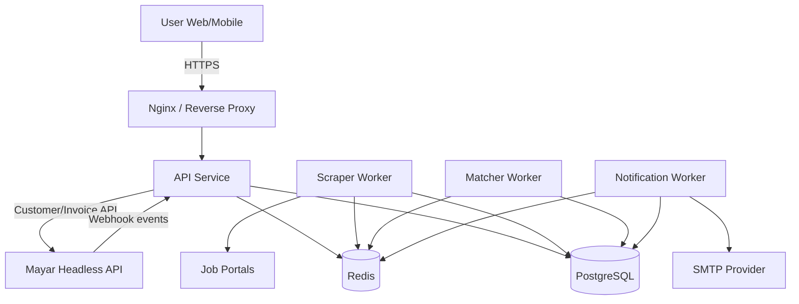

# System Architecture

## 1. Arsitektur Tingkat Tinggi

Bisakerja menggunakan pendekatan **modular monolith yang siap dipisah**. Kode berada dalam satu monorepo, namun service berjalan sebagai proses/container terpisah.

## 2. Komponen Utama

### 2.1 API Service (`cmd/api`)

Tanggung jawab:

- expose endpoint publik dan protected.
- validasi request.
- auth + authorization + ownership boundary check.
- konsumsi cache.
- orkestrasi usecase.
- orkestrasi billing ke Mayar (create customer + create invoice).
- memproses webhook inbound.

### 2.2 Scraper Worker (`cmd/scraper`)

Tanggung jawab:

- scraping source eksternal.
- parsing + normalisasi.
- deduplikasi.
- publish event lowongan baru.

### 2.3 Matcher/Notifier Worker (`cmd/notifier` / `cmd/worker`)

Tanggung jawab:

- konsumsi event lowongan baru.
- matching user preference.
- enqueue + kirim notifikasi.
- update status notifikasi.

### 2.4 Billing Retry Worker (opsional phase hardening)

Tanggung jawab:

- mengulang call outbound ke Mayar saat error transient (`429/5xx`).
- menjaga antrian retry tetap terkontrol.

## 3. Batas Konteks (Bounded Context)

- **Identity Context**: register/login/profile user.
- **Job Context**: ingestion, search, detail jobs.
- **Subscription Context**: checkout, payment event, premium status.
- **Notification Context**: matching, queueing, delivery status.
- **Admin Context**: operational control and statistics.

## 4. Reliability & Failure Handling

### API Layer

- timeout request downstream (DB/Redis/Mayar).
- structured error response (`meta` + `errors`).
- request ID untuk tracing.
- fallback ke DB jika Redis cache down.

### Worker Layer

- retry terbatas dengan backoff.
- status processing tersimpan (`pending/sent/failed`).
- idempotent inserts/updates.

### Billing Layer (Mayar)

- outbound throttle (aman di bawah 20 req/min/IP; target 18).
- retry dengan exponential backoff + jitter untuk `429/5xx` (max 3x).
- fallback ke rekonsiliasi (`invoice detail`, `transactions`, `webhook history`).

### Webhook Layer

- validasi token endpoint webhook.
- validasi payload wajib.
- idempotency key (`event + transactionId`).
- duplicate event -> response `200` tanpa side effect ulang.

## 5. Security Architecture

- JWT access token untuk protected endpoint.
- RBAC untuk endpoint admin.
- ownership boundary: user-scoped endpoint wajib pakai `JWT.sub`.
- CORS allowlist domain frontend.
- rate limiting per IP via Redis.
- secret API key Mayar disimpan di environment/secret manager.
- keamanan header dasar (`nosniff`, `DENY frame`).

## 6. Deployment Topology

### MVP

- 1 VPS.
- Docker Compose (`api`, `scraper`, `worker`, `postgres`, `redis`).
- Nginx reverse proxy + TLS.

### Evolusi Post-MVP

- pisah database ke managed Postgres.
- pisah redis ke managed Redis.
- scale API horizontal.
- scale worker berdasarkan queue depth.
- aktifkan worker khusus billing retry/reconciliation.

## 7. Observability (MVP Minimum)

### Wajib instrumentasi

- structured logging (`zerolog`) dengan `request_id`, `user_id` (jika ada), `endpoint`.
- metrik request API, error rate, queue depth.
- metrik scraping success/failure per source.
- metrik delivery notification success/failure.
- metrik outbound Mayar (`request`, `error`, `rate_limited`).
- metrik webhook Mayar (`received`, `processed`, `duplicate`, `failed`).

### Target Operasional Minimum

| Signal | Target |
|---|---|
| API availability (core endpoints) | >= 99.9% / bulan |
| API `5xx` error rate | <= 0.1% / 5 menit |
| Jobs API p95 latency | < 300 ms |
| Billing checkout API p95 latency | < 2 detik |
| Webhook processing p95 latency | < 500 ms |
