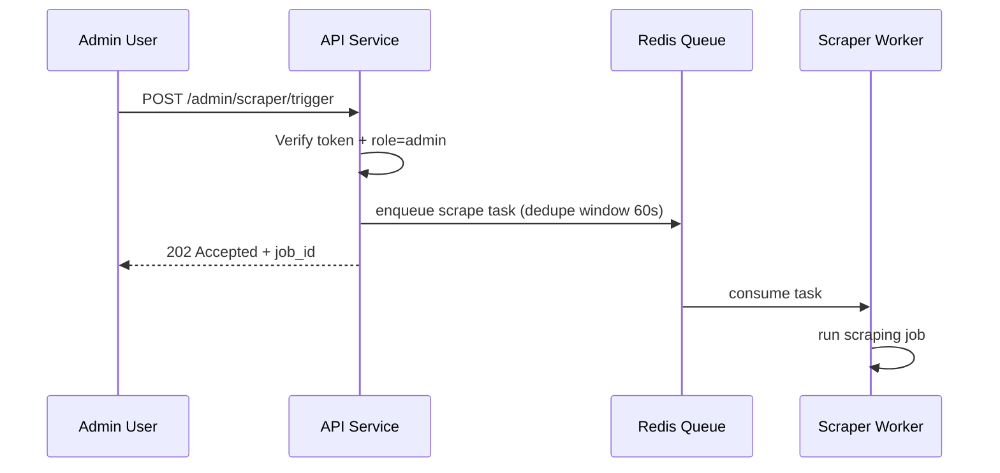
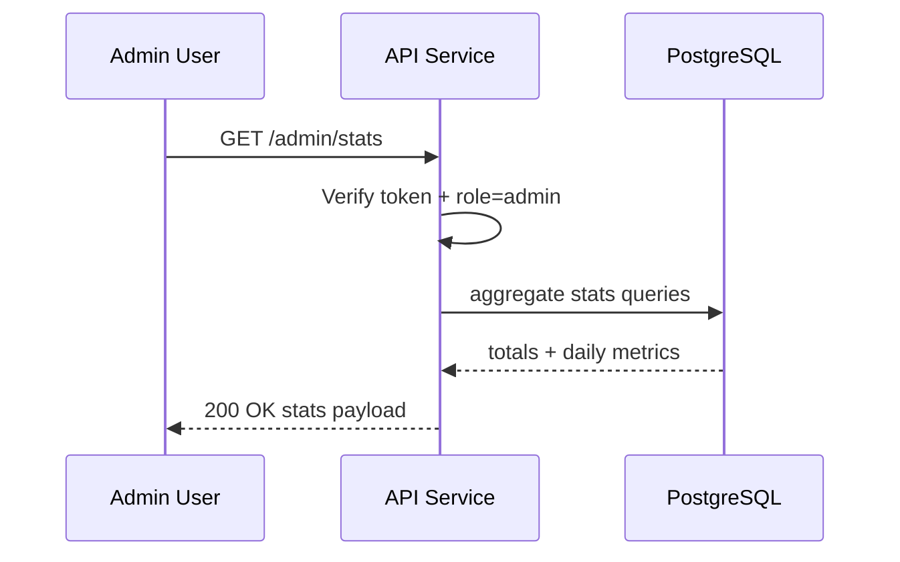

# Admin Operations Flow

## 1) Manual Scraper Trigger

## 2) Dashboard Stats

## Failure Path

| Kondisi | Respons |
|---|---|
| Non-admin request | `403 FORBIDDEN` |
| Invalid token | `401 UNAUTHORIZED` |
| Queue unavailable saat trigger | `503 SERVICE_UNAVAILABLE` |
