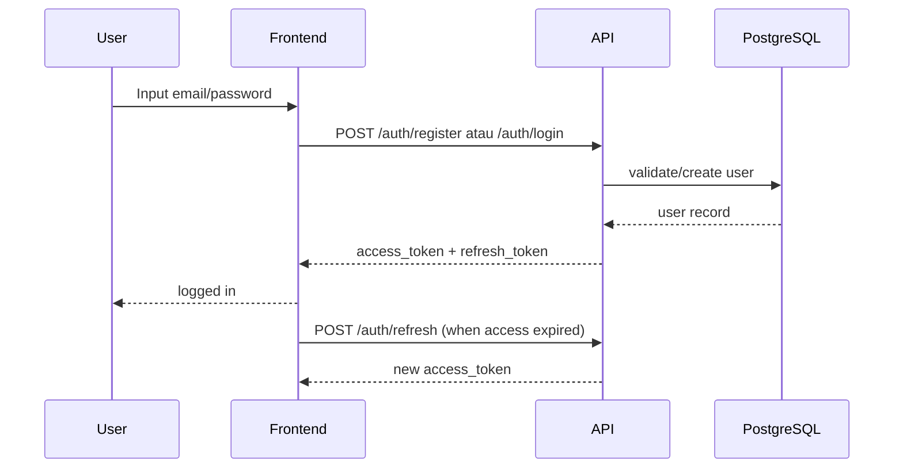
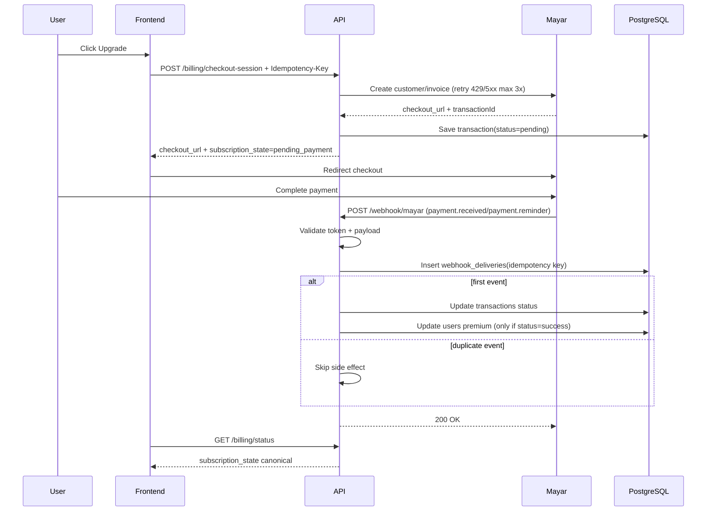

# Auth & Subscription Flow

## 1) Register/Login/Refresh

## 2) Upgrade to Premium

## Failure Path

| Kondisi | Respons | Dampak |
|---|---|---|
| Webhook token invalid | `401` | Event ditolak, tidak ada perubahan data |
| Webhook duplicate | `200` idempotent | Tidak ada update ganda |
| Mayar `429/5xx` saat create invoice | retry internal, lalu `503` jika gagal | User diminta retry |
| User tidak ditemukan dari webhook email | `422` | Event dicatat untuk rekonsiliasi manual |
