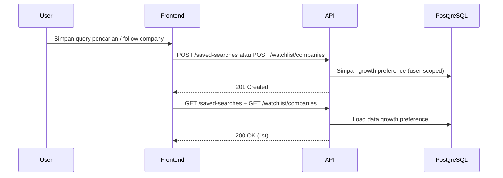
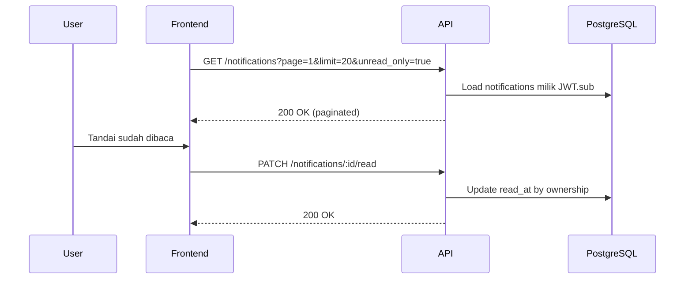

# Growth Engagement Flow

## 1) Saved Search & Watchlist Management

## 2) Notification Center Read Flow

## 3) Digest Preference Behavior

- `PUT /preferences/notification` mengontrol `alert_mode` (`instant`, `daily_digest`, `weekly_digest`) dan `digest_hour`.
- Saat `alert_mode` digest aktif, matcher menandai kandidat notifikasi sebagai `deferred_digest` (tidak langsung enqueue email instant).
- Entitlement premium tetap mengikuti canonical source `GET /billing/status.subscription_state`.
