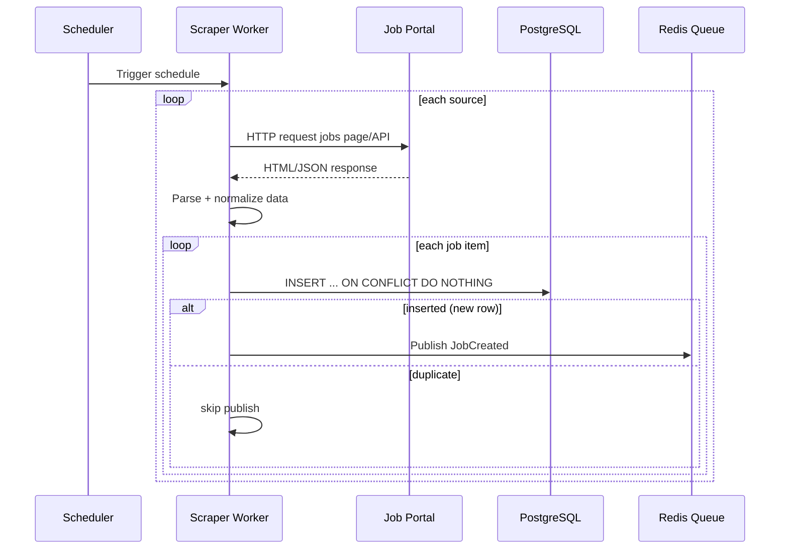
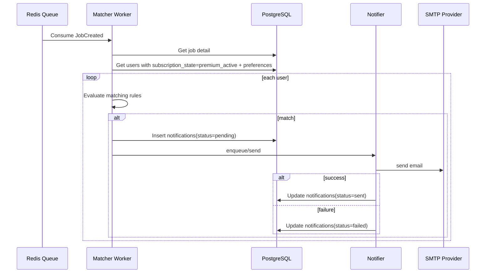

# Scraping & Matching Flow

## 1) Scraper Ingestion Flow

## 2) Matcher + Notification Flow

## Failure Path

| Kondisi | Mitigasi |
|---|---|
| Portal timeout/error | retry terbatas per source, source lain tetap lanjut |
| Duplicate job dari source sama | ditahan oleh `UNIQUE(source, original_job_id)` |
| SMTP down | set `failed`, retry policy worker |
| Redis queue down sementara | fallback ke retry queue / alert operasional |
