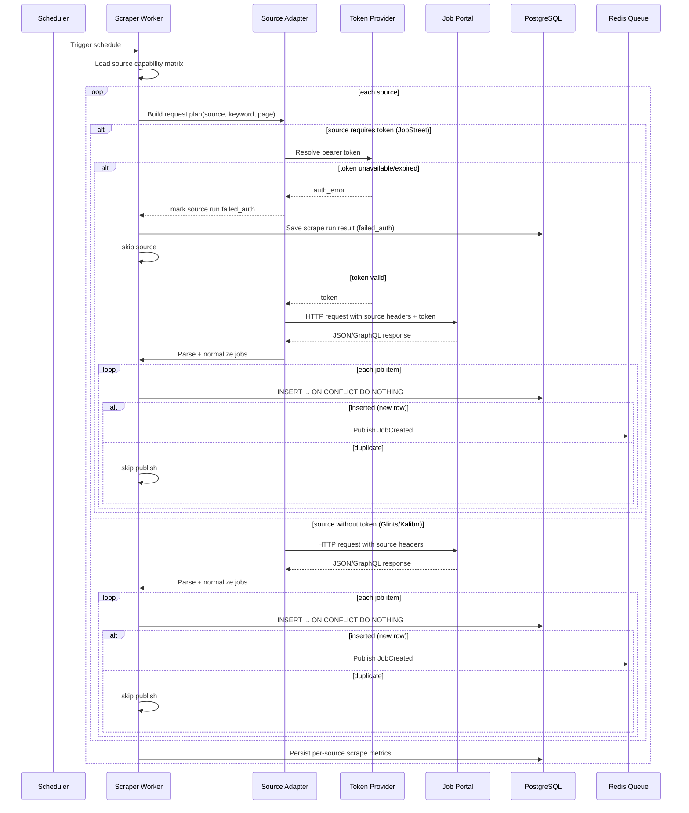
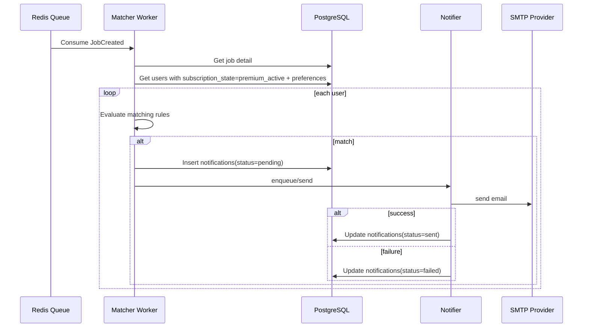

# Scraping & Matching Flow

## 1) Scraper Ingestion Flow (Source-Aware)

## 2) Matcher + Notification Flow

## 3) Preflight Checklist per Batch Scrape

1. Validasi source aktif (`glints`, `kalibrr`, `jobstreet`) dan keyword batch.
2. Cek `requires_auth` per source.
3. Untuk source auth-required, validasi token tersedia dan belum expired.
4. Set rate-limit budget per source (request concurrency + delay).
5. Inisialisasi run ID untuk observability dan audit.

## 4) Failure Path

| Kondisi | Mitigasi |
|---|---|
| Portal timeout/error | retry terbatas per source, source lain tetap lanjut |
| Missing/expired bearer token (JobStreet) | tandai `failed_auth`, lanjut source lain, trigger token refresh/runbook |
| `401/403` dari source auth-required | invalidasi token cache, rotate token, retry terbatas |
| Duplicate job dari source sama | ditahan oleh `UNIQUE(source, original_job_id)` |
| SMTP down | set `failed`, retry policy worker |
| Redis queue down sementara | fallback ke retry queue / alert operasional |
