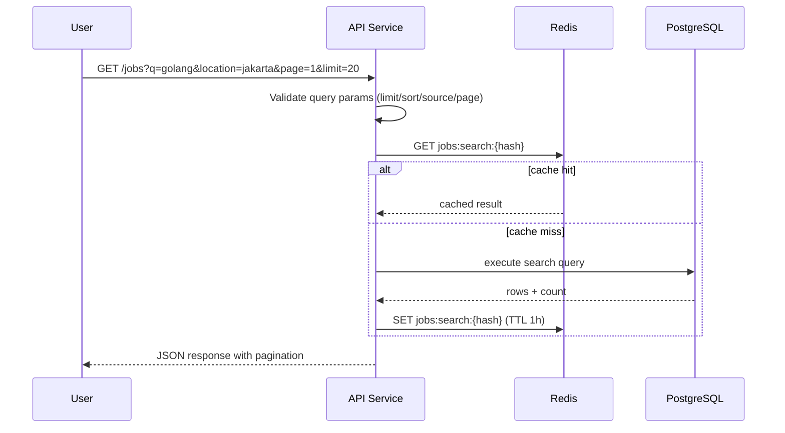
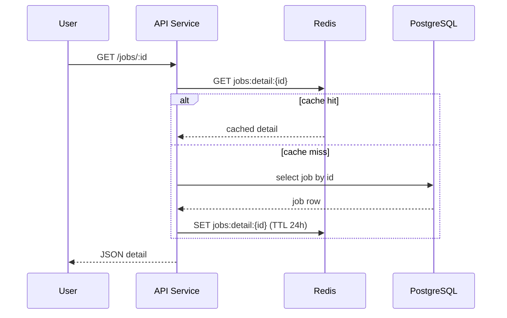

# Search Serving Flow

## Search Request Flow (Public)

## Job Detail Flow

## Failure Path

| Kondisi | Respons |
|---|---|
| Query invalid | `400 BAD_REQUEST` |
| Job not found | `404 NOT_FOUND` |
| Redis unavailable | fallback langsung ke DB (tanpa cache) |
| DB timeout | `503 SERVICE_UNAVAILABLE` + `request_id` untuk tracing |
