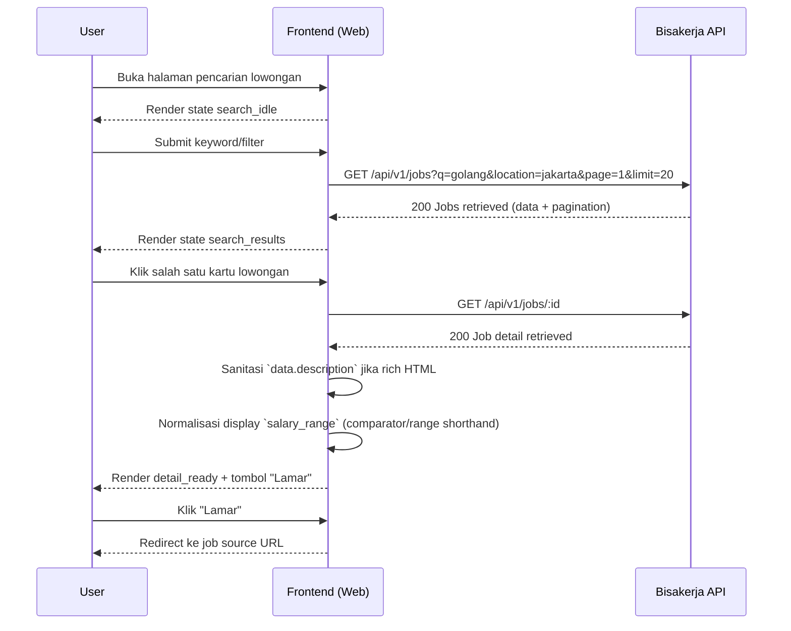
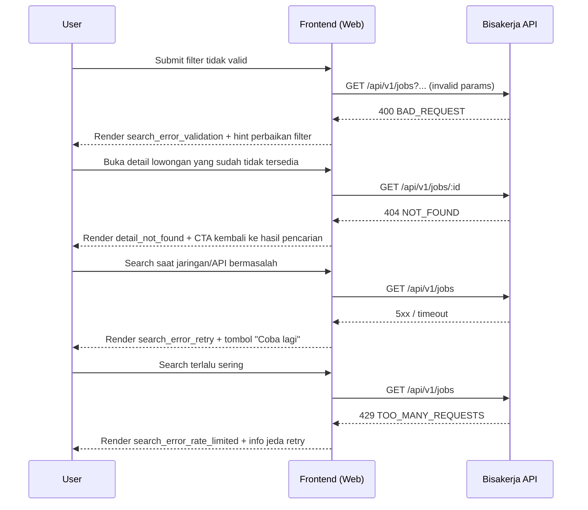

# Discovery Flow (Frontend)

## Tujuan

Menggambarkan alur user saat menemukan lowongan: dari submit search, melihat hasil, membuka detail, lalu lanjut apply ke URL sumber.

## Happy Path

## Failure Path

## UI State Transitions

| Current State | Trigger | Next State | Catatan UI |
|---|---|---|---|
| `search_idle` | User submit query/filter | `search_loading` | Disable submit sementara request berjalan |
| `search_loading` | `GET /api/v1/jobs` sukses + `data.length > 0` | `search_results` | Tampilkan list + pagination |
| `search_loading` | `GET /api/v1/jobs` sukses + `data.length = 0` | `search_empty` | Empty state dengan saran ubah keyword/filter |
| `search_loading` | `GET /api/v1/jobs` gagal (`400`) | `search_error_validation` | Tampilkan error validasi query |
| `search_loading` | `GET /api/v1/jobs` gagal (`429`) | `search_error_rate_limited` | Tampilkan cooldown + retry terkontrol |
| `search_loading` | `GET /api/v1/jobs` gagal (`5xx`/timeout) | `search_error_retry` | Tampilkan retry action |
| `search_results` | User klik job card | `detail_loading` | Tampilkan skeleton/overlay detail |
| `detail_loading` | `GET /api/v1/jobs/:id` sukses | `detail_ready` | Render detail lengkap + tombol apply |
| `detail_loading` | `GET /api/v1/jobs/:id` gagal (`404`) | `detail_not_found` | Tampilkan pesan lowongan tidak tersedia |

## Backend/API Touchpoints

- `GET /api/v1/jobs` — list/search jobs ([Jobs API](../../api/jobs.md)).
- `GET /api/v1/jobs/:id` — detail lowongan ([Jobs API](../../api/jobs.md)).
- Caching behavior untuk endpoint jobs mengikuti backend search-serving flow ([Search Serving Flow](../../flows/search-serving-flow.md)).

## Acceptance Criteria Flow

- URL filter (`q`, `location`, `salary_min`, `sort`, `page`, `limit`, `source`) selalu sinkron dengan request API list jobs.
- Pergantian filter utama me-reset `page=1` sebelum request dikirim.
- `404` detail selalu menghasilkan state `detail_not_found` dengan CTA kembali ke hasil.
- `429` dan `5xx` menampilkan state retry yang berbeda agar user tahu tindakan lanjutan.
- Konten `description` bertipe HTML tidak pernah dirender mentah; sanitasi frontend wajib aktif sebelum tampil.
- Salary fallback comparator seperti `<= 2999998`/`<= Rp 3.500.000` ditampilkan sebagai label friendly (`Up to Rp ...`) dan shorthand `Rp 8 – Rp 12 per month` tetap terformat readable.
