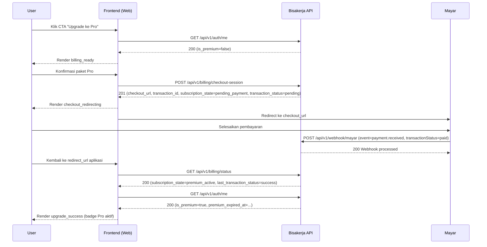
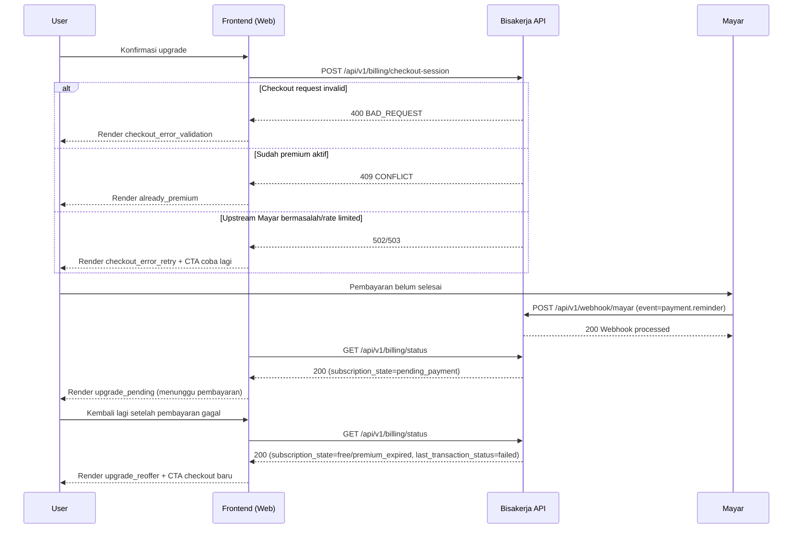

# Upgrade Billing Flow (Frontend)

## Tujuan

Menggambarkan journey upgrade user dari `free` menjadi `premium_active`, sinkron dengan kontrak Billing API dan event webhook Mayar.

## Happy Path

## Failure Path

## UI State Transitions

| Current State | Trigger | Next State | Catatan UI |
|---|---|---|---|
| `billing_ready` | User klik "Lanjut bayar" | `checkout_creating` | Disable tombol submit selama request |
| `checkout_creating` | `POST /api/v1/billing/checkout-session` sukses (`201`) | `checkout_redirecting` | Simpan `transaction_id`, lalu redirect ke `checkout_url` |
| `checkout_creating` | `400 BAD_REQUEST` | `checkout_error_validation` | Tampilkan validasi plan/redirect URL |
| `checkout_creating` | `409 CONFLICT` | `already_premium` | Tampilkan status premium aktif, tanpa redirect |
| `checkout_creating` | `502/503` | `checkout_error_retry` | Tampilkan retry action |
| `checkout_redirecting` | User kembali dari gateway | `payment_verifying` | Mulai cek status via `/api/v1/billing/status` |
| `payment_verifying` | `subscription_state=premium_active` | `upgrade_success` | Refresh `/api/v1/auth/me` untuk sinkronisasi UI global |
| `payment_verifying` | `subscription_state=pending_payment` | `upgrade_pending` | Tampilkan instruksi selesaikan pembayaran |
| `payment_verifying` | `subscription_state=free` atau `premium_expired` + `last_transaction_status=failed` | `upgrade_reoffer` | Tampilkan alasan gagal + CTA checkout baru |
| `payment_verifying` | timeout/5xx berulang | `upgrade_pending_manual_check` | Sediakan refresh manual + kontak support |

## Backend/API Touchpoints

- `POST /api/v1/billing/checkout-session` — create checkout session ([Billing API](../../api/billing.md)).
- `GET /api/v1/billing/status` — baca state subscription (`free`, `pending_payment`, `premium_active`, `premium_expired`) ([Billing API](../../api/billing.md)).
- `GET /api/v1/auth/me` — sinkronisasi flag `is_premium` di UI ([Auth API](../../api/auth.md)).
- `POST /api/v1/webhook/mayar` — asynchronous event processing (`payment.received`, `payment.reminder`) ([Webhooks API](../../api/webhooks.md)).
- Aturan bisnis subscription dan idempotency webhook: [Subscription & Billing](../../features/subscription-billing.md), [Mayar Integration](../../architecture/mayar-integration.md).

## Acceptance Criteria Flow

- Frontend tidak pernah menandai sukses premium hanya dari redirect/callback URL; verifikasi wajib lewat `GET /api/v1/billing/status`.
- `subscription_state` menjadi penentu final entitlement UI meskipun `last_transaction_status` masih pending/reminder.
- Error checkout (`400`, `409`, `502/503`) selalu memiliki next action yang jelas (perbaiki input, lihat status, retry).
- Pada status pembayaran gagal (`last_transaction_status=failed`), UI menampilkan re-offer checkout tanpa dead-end.
